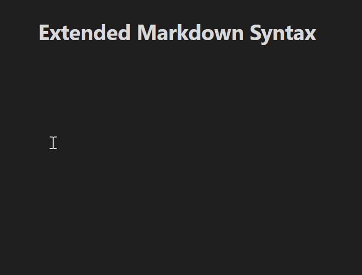
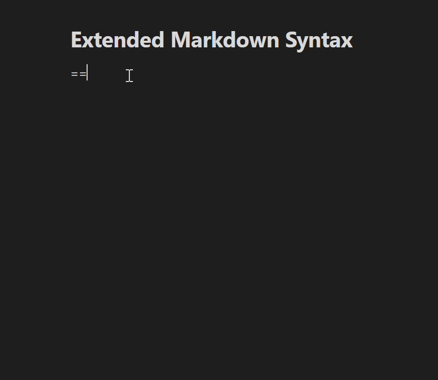

# Extended Markdown Syntax - Obsidian Plugin

Provides some alternatives for inline formatting using non-standard syntaxes instead of using html tags, such as underline, superscript, and much more.

You can easily create text that is <ins>underlined</ins>, <sup>superscripted</sup>, or <sub>subscripted</sub> without any pain of writing html tags. And don't forget, this plugin supports both modes: editor mode and preview mode.



## Features

This plugin has four main features:

1. Inline formatting (insertion, spoiler, superscript, subscript).
2. Paragraph aligning.
3. Custom highlight color.
4. Context-aware formatting.

> [!NOTE]
> As it should be, the syntax will not be parsed if it is inside inline-code, codeblock, inline-math, mathblock, and internal links. Instead, they will still be styled by those syntaxes if they are inside them.

### A. Inline Formatting

There is four formatting types that currently developed in this plugin: **insertion** (underline), **Discord-flavoured spoiler**, and **Pandoc-flavoured superscript and subscript**.

| Type        | Syntax              | Result                                             |
| ----------- | ------------------- | -------------------------------------------------- |
| insertion   | `++your text++`     | <ins>your text</ins>                                   |
| spoiler     | `\|\|your text\|\|` | <span style="background: #2e2e2e">your text</span> |
| superscript | `^your-text^`       | <sup>your-text</sup>                               |
| subscript   | `~your-text~`       | <sub>your-text</sub>                               |

By default, **insertion** give the text underline style, **spoiler** hide the text and can be revealed by clicking it (or hovering over it in editor mode), while **superscript** and **subscript** make the text being raised or lowered as `<sup>` and `<sub>` do.

The main advantage of using those syntaxes over html tags is that those syntaxes are rendered properly in the editor alongside other built-in syntaxes. So you can combine them without blocking other style being rendered in editor, in stark contrast to the html tags, for instance `this *is ++italic-underlined++*`.

To make clear and avoid ambiguity, some rules are applied to the syntaxes:

#### 1. General Rules for Inline Syntaxes (Insertion, Spoiler, Superscript, Subscript)

- Opening delimiter must not be followed by any whitespace character (regular space, tab, and new line), and the closing one must not be preceded by any whitespace character.
- Delimiter must satisfy its requiered length as will be explained later, and must not be preceded or followed by the same character as the delimiter, or the same non-escaped if configured for that.
- Delimiter must not be escaped, if it was configured to not be escaped, by a backslash. Otherwise, it will act as literal character.
- Formatting only occurs when opening delimiter met its closing.
- Content text, that is surrounded by delimiters, must at least one character.
- Content text must not have two or more new line character.
- Any built-in syntaxes from Obsidian has a higher precedence than that in this plugin.

For better understanding, the table below can give some example applying those rules:

| Valid                                              | Invalid                                    |
| -------------------------------------------------- | ------------------------------------------ |
| `++lorem++`                                        | `++ lorem++` `++lorem` `lorem++`           |
| `++lor em++`                                       | `++lorem ++`                               |
| `++l++`                                            | `++++`                                     |
| `++l+o+r+em++`                                     | `++dfdf+++`                                |
| `++lo++rem++` (third plus pair doesn't include)    | `++lo\nre\nm++` (`\n` as a new line char)  |
| `++lo\nr   e  m++`                                 | `+++lore++m+++`                            |
| `++ lor++em++` (first one doesn't include)         | `++ ++`                                    |
| `\+++lorem++ ++ipsum\+++` (if escaping is enabled) | `\++lorem++ +\++ipsum\++++`                |

#### 2. Rules for Insertion and Spoiler

- Insertion is defined as text consist at least one character surrounded by exactly double plus signs (`++`) on each side.
- Spoiler is the same as the insertion, it's just surrounded by exactly double bars (`||`) on each side.

```
++insertion++ +not insertion+ ||spoiler|| |||not spoiler||||
```

the expected result is:

>  <ins>insertion</ins> +not insertion+ <span style="background: #2e2e2e">spoiler</span> |||not spoiler||||

#### 3. Rules for Superscript and Subscript

- Superscript is defined as text consist at least one character surrounded by only single caret (`^`) on each side, and must not contain any of whitespace character.
- Subscript act like superscript, it's just use single tilde as delimiter.
- Thus, insertion and spoiler allow its content to have any whitespace character. It's contasts with the case of superscript and subscript.

```
^sup^ ^^not-sup^ ^not sup^, ~sub~ ~~not-sub~~~ ~not
sub~
```

will be rendered as:

> <sup>sup</sup> ^^not-sup^ ^not sup^, <sub>sub</sub> ~~not-sub~~~ ~not
> sub~

#### 4. Delimiter escaping

As already explained, using escaper backslash can change the semantic meaning to that being escaped. Escaped punctuation is treated as regular character that doesn't have functional use. This applies to those delimiters when "Delimiter escaping" option is switched on.

```
++insertion++ \++not insertion\++ in editor mode
```

However, we can only apply this feature in editor mode, since escaped character being rendered as normal character without being wrapped by any tag (and it makes sense).

```
++insertion++ \++still insertion\++ \+\+still insertion\+\+, \+++not insertion+\++ in preview mode
```

Due to this condition, "Delimiter escaping" was turned of by default to maintain consistency between editor and preview mode.

### B. Paragraph Aligning

Paragraph can be aligned by inserting one of specific tags exactly at the beginning of the line. Those tags are `!!left!!`, `!!right!!`, `!!center!!`, and `!!justify!!`, where each tag representing a type of alignment that should be used.

Note that any character that was prepended before the tag, even if it's just one space, will terminate the tag, so it's treated as regular characters.

```
!!center!!will be centered

 !!center!!will not be centered
```

It's will be rendered like this:

> <div>
> <p style="text-align: center">will be centered</p>
> <p> !!center!!will not be centered</p>
> </div>

#### Caution

In editor mode, each line depends on itself, so you must type alignment tag to get it be aligned. However, in preview mode, paragraph can consist more than one line. Accordingly, only tag that located at the first line of the paragraph (if it consists more than a line) will be treated as it is, and the others will act as a regular text.

So, this markdown

```
!!center!!aligned to the center in both modes
!!right!!aligned to the right in editor, to the center in preview
not being aligned in editor (or aligned to its initial), aligned to center in preview
```

will be rendered in editor like this:
> <p style="text-align: center">aligned to the center in both modes</p>
> <p style="text-align: right">aligned to the right in editor, to the center in preview</p>
> not being aligned in editor (or aligned to its initial), aligned to center in preview

and in preview like this:
> <p style="text-align: center">
> aligned to the center in both modes<br>
> !!right!!aligned to the right in editor, to the center in preview<br>
> not being aligned in editor (or aligned to its initial), aligned to center in preview<br>
> </p>

### C. Custom Highlight Color

Color of each highlight can be customized by adding color tag exactly after its opening delimiter. The tag consists of opening curly bracket `{`, alphanumeric character(s) `a-zA-Z0-9` (at least one, can be added with minus sign `-`), and closing curly bracket, for example: `=={red}Red==, =={Green2}Green==, =={ocean-blue}Blue==`.

| Valid color tag        | Invalid color tag                                         |
| ---------------------- | --------------------------------------------------------- |
| `=={color}lorem==`     | `== {color}lorem==`, `==a{color}lorem==`                  |
| `=={abcAb--10}lorem==` | `=={ }lorem==,` `=={*_}lorem==`, `=={green_color}lorem==` |

Valid color tag will be added in the highlight classes, so `=={red}Red==` will be parsed in html tag as **`<span class="cm-custom-highlight cm-custom-highlight-red">`** in editor and **`<mark class="custom-highlight custom-highlight-red">`** in preview mode. This plugin bring some predefined CSS rules that automatically give customized color to the highlight. Those predifined colors are red, orange, yellow, green, cyan, blue, purple, pink, and accent (accent color of your app).

For ease access, in the editor, the color button will appear after opening delimiter when the cursor or selection touches the highlight. Clicking on it shows colors menu and let the user choose the desired color (you can disable the color botton in settings, and thus will be hidden in the editor).



> [!note]
>
> Currently, other colors can only be customized through CSS. In the future, I would like to add a feature that can customize and add other colors through the settings.

### D. Context-aware Formatting

Any syntaxes that are written in the codespan, codeblock, math, comment, and wikilink don't apply the rules, so they  are treated according to their context. Or, in the nutshell, they aren't formatted. This corresponds to the many of markdown implementation, as well as that implemented in Obsidian.

In addition in the editor, any formatting above doesn't overlapping its block context. So if opening delimiter, i.e. double plus signs for insertion, was found in heading, and didn't meet any double plus signs but in the next line (which is paragraph for instance), then the second delimiter isn't treated as a closing for that opening.

Example below can give some better understanding:

Markdown:
> ```
> # Heading ++1
> The paragraph.++
> 
> Another ++paragraph
> > Blockquote++
> 
> 1. ++List
> 2. another list++
> 3. another ++list
> lazy continuation++
> ```

Expected result:
> <h1>Heading ++1</h1>
> The paragraph.++
> 
> Another ++paragraph
> <blockquote>Blockquote++</blockquote>
> 
> <ol><li>++List</li>
> <li>another list++</li>
> <li>another <ins>list
> <br>lazy continuation</ins></li></ol>

---

## Features to be Implemented in The Future

- [x] Enable/disable formatting in settings
- [x] Applicable on mobile
- [ ] Fixing paragraph alignment bug
- [ ] Customize formatting styles and highlighting colors
- [ ] Applying syntax quickly using shortcuts and context menu
- [ ] More syntaxes, if necessary

## Other Known Issues

- Cannot escape spoilers that are inside table cells (in source mode)

Feel free to let me know if you find any bugs...

## Credit

Thanks to:
- [Pandoc](https://pandoc.org/MANUAL.html) for the idea of superscript and subscript,
- [CommonMark](https://spec.commonmark.org/) and [Github Flavored Markdown](https://github.github.com/gfm/) for the markdown specification.
- [Discord](https://discord.com/) for the spoiler idea.
- [Superschnizel](https://github.com/Superschnizel/obisdian-fast-text-color) for interactive menu idea,
- [Mara-Li](https://github.com/Mara-Li/obsidian-regex-mark) for some code snippets,
- [marcel-goldammer](https://github.com/marcel-goldammer/obsidian-keyword-highlighter),
- [attcoleanderson](https://github.com/mattcoleanderson/obsidian-dynamic-text-concealer)