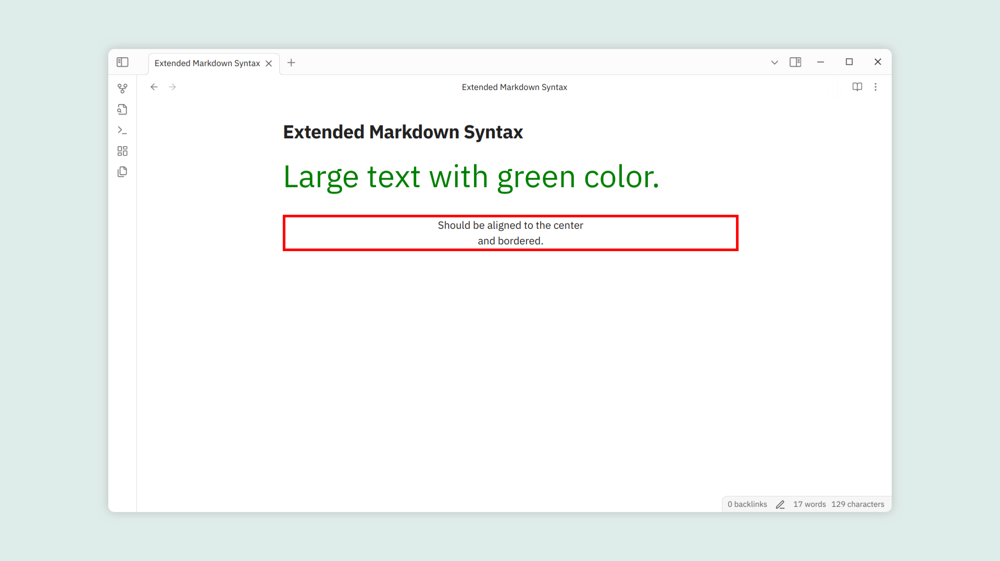

# Noctus Obsidian Plugin (WIP)

> Based on the (frankly impressive) [Extended Markdown Syntax Plugin by kotaindah55](https://github.com/kotaindah55/extended-markdown-syntax). Thank you!
> Currently only features underline & discord-flavored subtext on top of the original features. 
> **The plugin is currently dysfunctional due to a BlockRules error from the implementation of new syntax**
> README has been adapted for most and primarily reflects future plans (inconsistencies will be adressed soon!).

Provides alternatives to HTML Tags for inline and block formatting, extending the Obsidian-flavored Markdown syntax with the Noctus-flavored Markdown syntax such as underline, superscript, and much more. 
Your formatting will be more diverse, direct, and clear using this plugin!

> ![Note]
>
> This plugin is intended to be used with the [Noctus Obsidian Theme (WIP)](https://github.com/Reparse-dev/noctus-obsidian-theme)

## 🚀 Main Features

- Extended inline syntax, including:
    - insertion (`++insertion++`),
    - underline (`=underline=`),
    - Discord-flavored spoiler (`||spoiler||`),
    - Discord-flavored subtext (`-#subtext`),
    - Pandoc-style superscript (`^sup^`) and subscript (`~sub~`),
    - support for custom color classes for highlight (`=={color}mark==`), and
    - custom span with ability to insert your own class(es) and attributes (`<span{attribute/class}>`).
- _Modified_ Pandoc-style fenced div for block-level syntax (`:::`).
- Edit formatted text directly without omitting its style, in contrast to using HTML tags.
- Context-aware, syntax won't be parsed while it encounters such a codeblock, codespan, or context boundary.
- Quick format with commands and context menu.
- Toggle specific syntax on and off.
- Customize your own color attributes for custom highlight.
- Predefine your own classes for custom span and fenced div.
- **Supports rendering exported PDF.**

## ✍️ Usage

### 1. Inline Formatting

There are six inline formattings that currently developed in this plugin:

| Type        | Syntax                 | Result                                                        |
| ----------- | ---------------------- | ------------------------------------------------------------- |
| insertion   | `++your text++`        | <ins>your text</ins>                                          |
| spoiler     | `\|\|your text\|\|`    | <span style="background:#2e2e2e">your text</span>             |
| superscript | `^your-text^`          | <sup>your-text</sup>                                          |
| subscript   | `~your-text~`          | <sub>your-text</sub>                                          |
| highlight   | `=={color}your text==` | <mark>your text</mark>                                        |
| custom span | `<{class}your text>`   | your text (should be rendered with the `myCls` class defined) |

By default:
- **insertion** give the text a green highlighted and underline style,
- **underline** gives the text an underline style,
- **spoiler** hide the text and can be revealed by clicking it (or hovering over it in editor mode),
- **superscript** and **subscript** make the text being raised or lowered as `<sup>` and `<sub>` do.
- **subtext** makes text smaller and less obvious.

Additionally, for the **highlight** and **custom span**, you may insert a tag right after the opening delimiter, specifying the color for the highlight, and the classes for the custom span.

### 2. Block Formatting

Currenty, this plugin only support **Pandoc-style fenced div** with some modifications. You only need an opening delimiter (three consecutive colons at least) to start the syntax. Blank line or the end of the document will act as a syntax closing. No need of closing delimiter.

```markdown
::: my-class-1 my-class-2
This is fenced div content.

::: another-class
Another fenced div content.
```

### 3. Customizable Highlight

Under "Custom highlight" section in the settings, you can:

- **show the color button**, providing color menu when you click on it,
- **adjust opacity** of the highlight,
- **customize color palettes** based on its tag:
    - first field for its name displayed in the color menu,
    - second field for its tag inserted into the highlight syntax,
    - show or hide each palette from the color menu,
    - rearrange colors by dragging 6-dots icon on the left side.

### 4. Predefined Tags

In the settings, you can predefine specific tags for **custom span** and **fenced div**, then can be displayed in the tag menu. Same as the color palattes, you can set their name and arrange them.

### 5. Commands and Context Menu

This plugin provides commands to toggle each formatting type, also commands to show the color and tag menu. You can set the keymap for each of them through "Hotkeys" in the settings.

It also brings functionality of all those commands (except for fenced div) to the context menu, by right-clicking on the editor and choosing "More format".

> [!Note]
>
> In mobile devices, those commands can be added into the toolbar.

### 6. Tidier Formatting

With "Tidier formatting" enabled in the settings, you can format a single word simply by placing the cursor on it, without the need to select the entire word. Otherwise, it acts like a normal wrapper.

### 7. Other Tweaks

- Enable/disable each formatting type individually under "Syntax switch" section.
- Prevent fenced div from being styled in source mode.
- Specifies when tags should be displayed under "Tag display behavior" section.
- etc...

> [!Note]
> 
> You don't need to reload the app after changing the settings.

## 🎨 Styling Custom Spans and Fenced Divs

With tag attached to them, you can insert your own CSS style rules based on their tag. For instance, you can apply this CSS rules to the markdown below:

```css
.text-large { font-size: 48px }
.text-green { color: green }

.align-center { text-align: center }
.bordered { border: 4px solid red }
```

```markdown
!!{text-large text-green}Large text with green color.!!

:::align-center bordered
Should be aligned to the center
and bordered.
```

<details>
<summary>Expected result:</summary>

</details>

> [!Note]
>
> For which characters are allowed in the tag, see "Syntax Rules" section below.

## 📜 Syntax Rules

We move the explanation to [this page](./docs/rule.md).

## 📦 Installation

- In-app
    - Open settings.
    - Choose "Community plugins" setting tab.
    - Turn off "Restricted mode" if it was enabled before.
    - Click "Browse" at "Community plugins" item.
    - Type "Extended Markdown Syntax" in the search box.
    - Install and enable it.
- Manual
    - Create a folder named `extended-markdown-parser` under `YOUR_VAULT_NAME/.obsidian/plugins`.
    - Place `manifest.json`, `main.js`, and `style.css` from the latest release into the folder.
    - Enable it through the "Community plugin" setting tab.
- Using [BRAT](https://github.com/TfTHacker/obsidian42-brat)
    - Install and enable "BRAT" plugin in "Community plugins" list.
    - Choose "BRAT" setting tab.
    - Click "Add beta plugin" under "Beta plugin list" section.
    - Enter this repo link into "Repository" input field.
    - Check "Enable after installing the plugin" and click "Add Plugin".

## ❓ FAQ's

### Is it working on the table and callout?
Of course it's working on both, except for the fenced div.

### Does the plugin work on large files?
I tested it on a 250kB file and it's still working fine. This plugin also uses parser that implemented simple incremental and partial parsing, so you don't need to worry about facing with large files. But if you still have some issues with it, feel free to inform me what the issues you are struggling with.

### Will it cause conflict with other plugins that concerns extending syntax?
It depends on what character the others use in their syntax, if it overlaps conflict could be caused.

## 📋 Roadmap

- [ ] Fix BlockRules error (which is making the Plugin dysfunctional as of now)
- [ ] Properly implement Discord-flavored Subtext (`-#`)
- [ ] Properly implement intended `<{class}span>` (and alternative `<span{attribute/class}>`) syntax
- [ ] Extend the curly bracket functionality in custom span to allow for adding HTML attributes, similar to [javalent's Markdown Attributes](https://github.com/javalent/markdown-attributes).
- [ ] Add inline attribute functionality: `||{color}spoiler{attribute/class}||` (color changes color when concealed), `=={color}highlight{attribute/class}==`, `={color}underline{attribute/class}=` (color changes underline color only), `++insertions{attribute/class}++`
- [ ] Fix delimiter escape for rendered Markdown.

## ⚙️ Compatibility Note

The original [Extended Markdown Syntax Plugin by kotaindah55](https://github.com/kotaindah55/extended-markdown-syntax) plugin has been tested in the latest version of Obsidian (about 1.7.x - 1.8.x), and hasn't been tested yet in the version 1.6.x and below.

## 🐞 Known Issues

- Plugin dysfunctional due to BlockRules error as of now
- Delimiter escaping doesn't work in the preview mode.
- Cannot escape spoilers that are inside table cells (in source mode). (**cannot be fixed**)

Feel free to let us know if you find bugs! Github issues are always welcome.

## 🙏 Credits & Acknowledgment

Thanks to:
- [javalent's Markdown Attributes](https://github.com/javalent/markdown-attributes) & [Pandoc](https://pandoc.org/MANUAL.html) for the idea of some syntax,
- [CommonMark](https://spec.commonmark.org/) and [Github Flavored Markdown](https://github.github.com/gfm/) for the markdown specification.
- [Discord](https://discord.com/) for the spoiler & subtext idea.
- [Superschnizel](https://github.com/Superschnizel/obisdian-fast-text-color) for interactive menu idea,
- [Exaroth](https://github.com/exaroth/mdx_custom_span_class) for custom span idea.
- [Mara-Li](https://github.com/Mara-Li/obsidian-regex-mark) for some code snippets,
- [marcel-goldammer](https://github.com/marcel-goldammer/obsidian-keyword-highlighter) for highlighting inspiration,
- [attcoleanderson](https://github.com/mattcoleanderson/obsidian-dynamic-text-concealer) for a dynamic text conceal example.

Special thanks to [kotaindah55](https://github.com/kotaindah55/extended-markdown-syntax) for laying the ground work for this plugin with the [Extended Markdown Syntax Plugin](https://github.com/kotaindah55/extended-markdown-syntax), which is impressive in its userfriendliness, customizability, and scope. 
